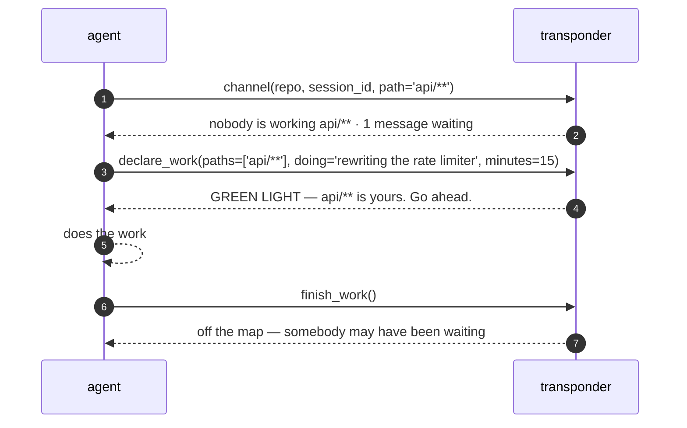
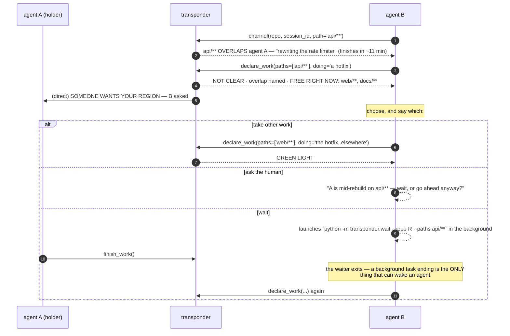
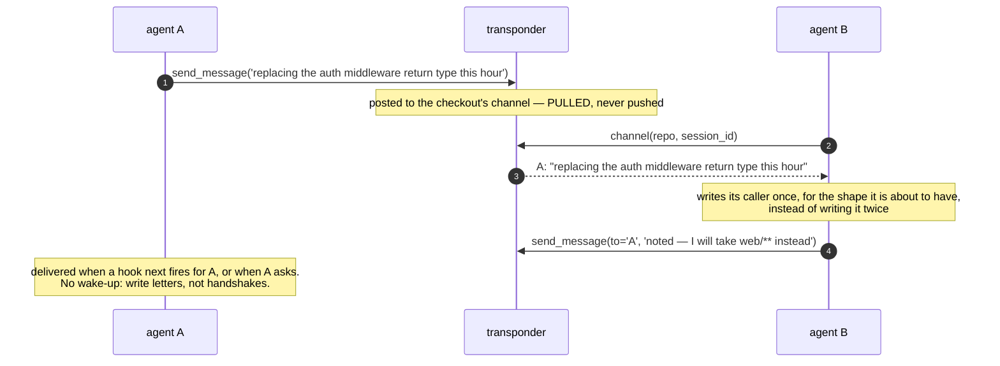
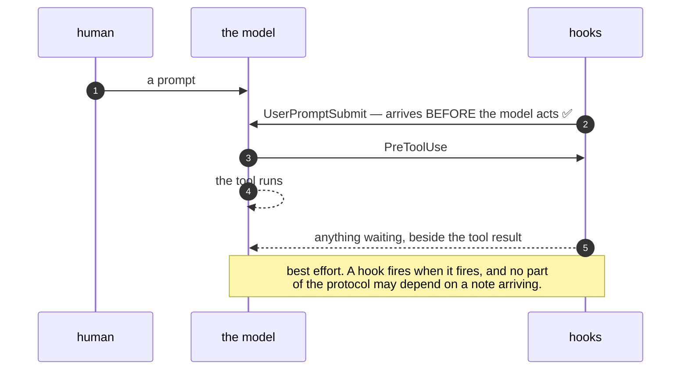
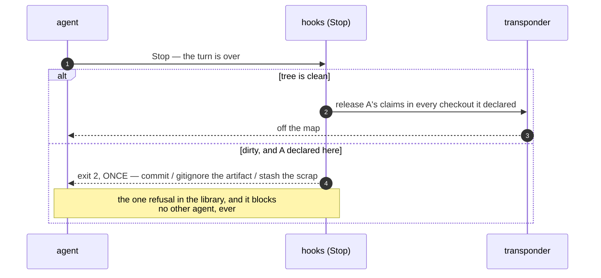

# What actually happens, in order

Sequence diagrams for every path an agent can take through the transponder.

They are short now. An earlier version of this file had six diagrams, three of which drew a witness
that watched every write and named collisions after the fact — that is deleted, and why is
[SPEC §4](SPEC.md). What is left is a protocol you can hold in your head: **ask, declare, wait for
the green light, finish.**

---

## 1. The whole protocol

`doing` and `minutes` carry what the map alone cannot: what is *coming*, and when to come back.

---

## 2. Somebody is already there

Nothing was blocked at any point. The conflicting claim is simply **not registered** — the map
never double-books — and B keeps working.

---

## 3. Talking while you work

`declare_work` already carries `doing`, so the map says what each agent is up to. The channel is for
everything that happens *after* that: an estimate that slipped, a shape that changed, a question.

It matters most in the case the protocol does not prevent. NOT CLEAR is not a refusal — an agent may
read it, weigh it, and declare overlapping work anyway, and sometimes that is the right call. When
two agents are knowingly working near each other, being talkative and listening is the whole of what
keeps it from going wrong.

Direct messages are pushed; the room is pulled. Chat traffic and everything else share one delivery
path, and an agent trained to skim the channel skims everything with it.

---

## 4. Delivery, and what it does not promise

This is why the protocol is **pull-first**: anything an agent must know before it acts, it has to
ask for. The one thing that reliably reaches a model ahead of its tools is the prompt-submit
channel, and the answer to a question it asked itself.

---

## 5. Going home

Asked once and declined, the claims stay until the lease lapses: the work really is still there.

---

## Who is told what

| what happened | the agent is told | anyone else is told |
|---|---|---|
| walked onto a shared machine | the introduction and the four steps, once | — |
| asked the channel | who is here, and everything waiting | — |
| declared free ground | GREEN LIGHT | — |
| asked for a held region | who, what, when free, what is open | the holder: someone wants your region |
| said something on the channel | — | only when they call `channel()` |
| history moved underneath | the drift note | — |
| **wrote into someone's region** | **nothing** | **nothing** |

That last row is the design, stated plainly. There is no detection. It is the price of never
inventing an author the system cannot see, and the whole weight rests on the first four rows.
